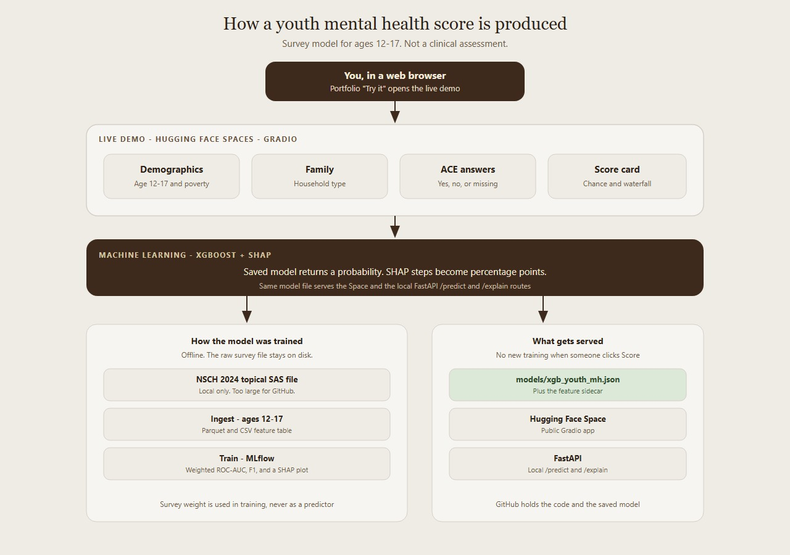
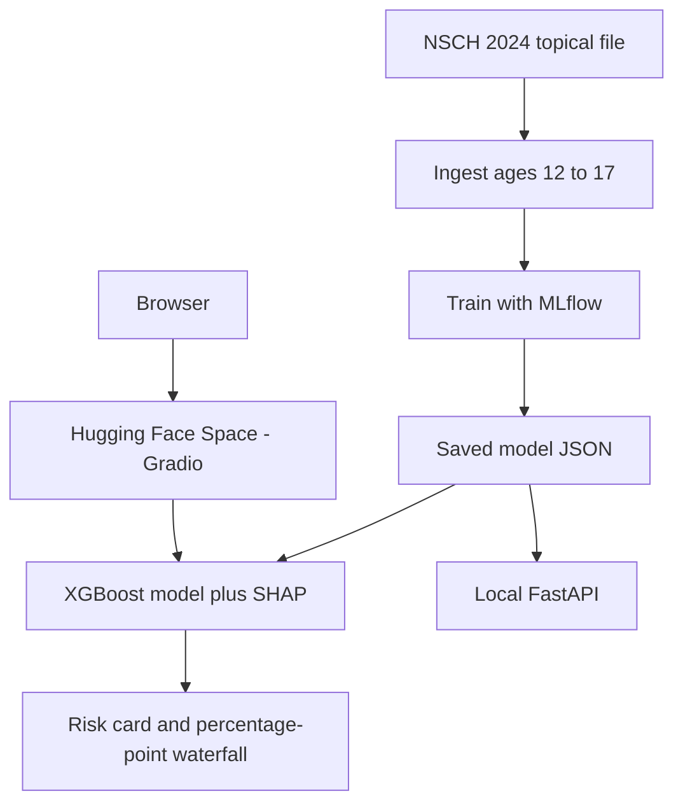

# Youth mental health risk

A machine learning app that estimates the chance a youth age 12–17 has ever been told they have depression, anxiety, or a behavior problem. The score comes from the 2024 National Survey of Children's Health. The live demo is a [Hugging Face Space](https://huggingface.co/spaces/Sneha-nag/youthmentalhealth). It is a survey model for explanation, not a clinical assessment.



## What you can do

1. Enter age, family poverty level, household type, and three adverse childhood experience answers. Unanswered items can stay missing.
2. See a low, moderate, or high risk card.
3. Read a SHAP waterfall in percentage points: blue lowers the chance, red raises it.
4. Call the same model from FastAPI at `/predict` and `/explain`.

## Model

The public-use NSCH 2024 topical file has 51,375 children. Ingest keeps ages 12–17 with a known outcome: 21,737 youth. The outcome is 1 when any of depression (`K2Q32A`), anxiety (`K2Q33A`), or behavior or conduct problems (`K2Q34A`) is yes, and 0 when all three are no.

| Feature | Survey source | Role |
| --- | --- | --- |
| Age | `SC_AGE_YEARS` | Predictor, 12–17 |
| Poverty level | `FPL_I1` | Family income as a percent of the federal poverty level |
| Family structure | `FAMILY_R` | Collapsed household type |
| Parent or guardian divorced | `ACE3` | Yes, no, or missing |
| Neighborhood violence | `ACE7` | Victim of violence or witnessed neighborhood violence |
| Unfair treatment because of race | `ACE10` | Yes, no, or missing |
| Unanswered ACE items | 10 ACE indicators | Count of blanks, not an ACE total |
| Survey weight | `FWC` | Training weight only. Never a predictor. |

`ACE7` is neighborhood violence. `ACE10` is unfair treatment because of race. Missing ACE answers stay missing. A count of ACE items is computed for the table and is not used in the model.

Training is an 80/20 stratified split (`random_state=42`) with XGBoost and the raw survey weight as `sample_weight`. MLflow records the run. On the held-out test set the weighted ROC-AUC is 0.571 and the unweighted ROC-AUC is 0.590. Most scores stay below 50%, so F1 at a 0.5 threshold is low (weighted F1 0.141). Age and income do not move the score in one direction.

## Architecture



The raw SAS file is about 179MB and is not in Git. Scoring uses `models/xgb_youth_mh.json` and `models/xgb_youth_mh_features.json`.

## Project layout

```
youthmentalhealth/
  app/gradio_app.py          Hugging Face / local Gradio UI
  src/data_pipeline/ingest.py
  src/models/train.py        XGBoost, MLflow, SHAP summary
  src/models/predict.py
  src/api/main.py            FastAPI
  models/                    Saved model and feature sidecar
  data/processed/            Youth feature table
  docs/architecture.jpg
```

## Technologies

- **Machine learning:** XGBoost, scikit-learn, SHAP, MLflow
- **Live demo:** Hugging Face Spaces, Gradio
- **API:** FastAPI, uvicorn
- **Data:** pandas, pyreadstat, Parquet

## Run locally

Python 3.12. From the project root:

```powershell
pip install -r requirements.txt
python -m app.gradio_app
```

The UI is at [http://127.0.0.1:7860](http://127.0.0.1:7860).

The API:

```powershell
python -m src.api.main
```

Retrain after a new ingest:

```powershell
python src/data_pipeline/ingest.py
python -m src.models.train
```

Ingest needs `data/raw/nsch_2024e_topical.sas7bdat` on disk. That file is gitignored because it exceeds GitHub's file size limit.

## Limits

Discrimination is modest. A higher score is an association in this survey, not a diagnosis and not a prediction for a child outside the sample design. Do not use it to screen or treat anyone.
